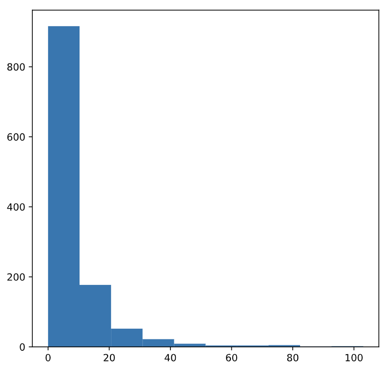

# Charting practice #

Try using your new skills to find and chart the number of words per line in the script using `matplotlib`. The Holy Grail script is loaded for you, and you need to use regex to find the words per line.

Using list comprehensions here will speed up your computations. For example: `my_lines = [tokenize(l) for l in lines]` will call a function `tokenize` on each line in the list `lines`. The new transformed list will be saved in the `my_lines` variable.

You have access to the entire script in the variable `holy_grail`. Go for it!

## Instructions ##

* Split the script into lines using the newline (`'\n'`) character.
* Use `re.sub()` inside a list comprehension to replace the prompts such as `ARTHUR:` and `SOLDIER #1`. The pattern has been written for you.
* Use a list comprehension to tokenize `lines` with `regexp_tokenize()`, keeping only words. Recall that the pattern for words is `"\w+"`.
* Use a list comprehension to create a list of line lengths called `line_num_words`.
   * Use `t_line` as your iterator variable to iterate over `tokenized_lines`, and then `len()` function to compute line lengths.
* Plot a histogram of `line_num_words` using `plt.hist()`. Don't forgot to use `plt.show()` as well to display the plot.

```python
# Split the script into lines: lines
lines = holy_grail.split('\n')

# Replace all script lines for speaker
pattern = "[A-Z]{2,}(\s)?(#\d)?([A-Z]{2,})?:"
lines = [re.sub(pattern, '', l) for l in lines]

# Tokenize each line: tokenized_lines
tokenized_lines = [regexp_tokenize(s, "\w+") for s in lines]

# Make a frequency list of lengths: line_num_words
line_num_words = [len(t_line) for t_line in tokenized_lines]

# Plot a histogram of the line lengths
plt.hist(line_num_words)

# Show the plot
plt.show()
```

