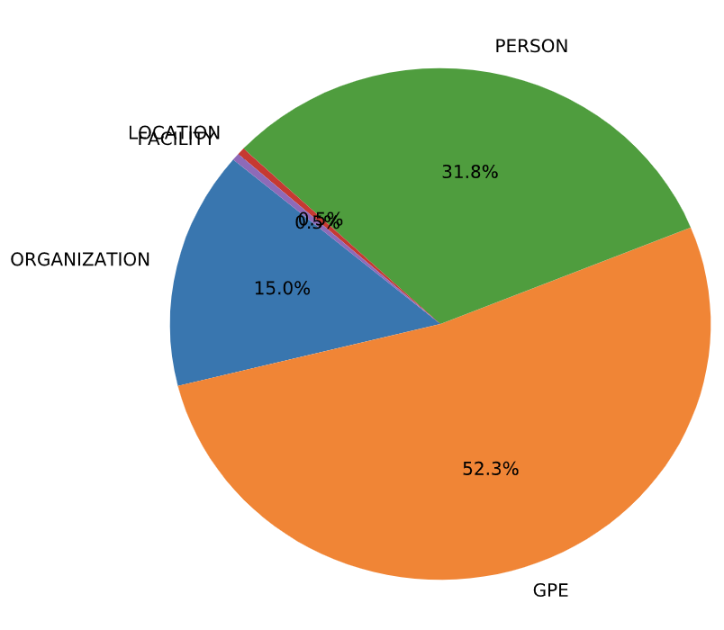

# Charting practice #

In this exercise, you'll use some extracted named entities and their groupings from a series of newspaper articles to chart the diversity of named entity types in the articles.

You'll use a `defaultdict` called `ner_categories`, with keys representing every named entity group type, and values to count the number of each different named entity type. You have a chunked sentence list called `chunked_sentences` similar to the last exercise, but this time with non-binary category names.

You can use `hasattr()` to determine if each chunk has a `'label'` and then simply use the chunk's `.label()` method as the dictionary key.

## Instructions ##

* Create a `defaultdict` called `ner_categories`, with the default type set to `int`.
* Fill up the dictionary with values for each of the keys. Remember, the keys will represent the `label()`.
   * In the outer `for` loop, iterate over `chunked_sentences`, using `sent` as your iterator variable.
   * In the inner `for` loop, iterate over `sent`. If the condition is true, increment the value of each key by 1.
* For the pie chart labels, create a list called `labels` from the keys of `ner_categories`, which can be accessed using `.keys()`.
* Use a list comprehension to create a list called `values`, using the `.get()` method on `ner_categories` to compute the values of each label `l`.
* Use `plt.pie()` to create a pie chart for each of the NER categories. Along with `values` and `labels=labels`, pass the extra keyword arguments `autopct='%1.1f%%'` and `startangle=140` to add percentages to the chart and rotate the initial start angle.
* Display your pie chart. Was the distribution what you expected?

```python
# Create the defaultdict: ner_categories
ner_categories = defaultdict(int)

# Create the nested for loop
for sent in chunked_sentences:
    for chunk in sent:
        if hasattr(chunk, 'label'):
            ner_categories[chunk.label()] += 1
            
# Create a list from the dictionary keys for the chart labels: labels
labels = list(ner_categories.keys())

# Create a list of the values: values
values = [ner_categories.get(l) for l in labels]

# Create the pie chart
plt.pie(values, labels=labels, autopct='%1.1f%%', startangle=140)

# Display the chart
plt.show()
```

